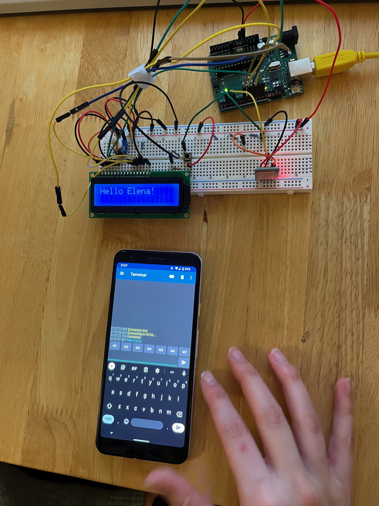
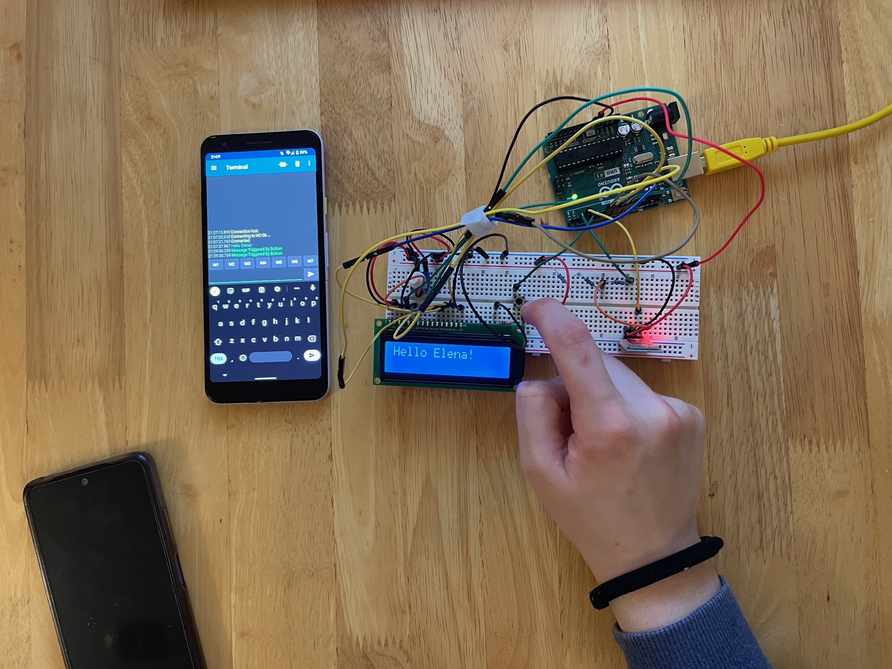

# control-arduino-using-bluetooth

For this project, I aimed to create a system that displays text sent from an Android phone via Bluetooth onto an LCD screen controlled by an arduino, with the added functionality of displaying a message on the phone when a button connected to the arduino is pressed.

Message sent from phone and displayed on LCD:  

Message sent arduino to phone when a button is pressed:  

